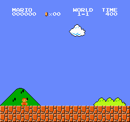
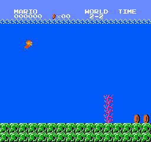
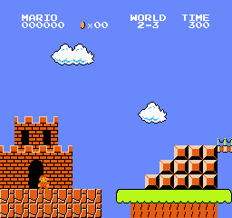
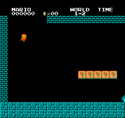
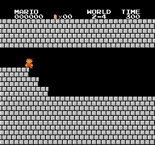

# Super Mario Bros using Double Deep Q Learning

This repository contains the code for an **agent** that can play **Super Mario Bros Game** using **Double Deep Q Learning Algorithm**. 

<p align="center">
 
 
 <br/>
 
 
 <br/>
 
 
 <br/>
<i><b>Result</b></i>
</p>

## Double Deep Q Learning Algorithm

**Double Deep Q Learning** reduces the overestimation occured in **Deep Q Learning** by **decomposing the max operation in the target into action selection and action evaluation**. 

This is done by using two independent agents, **Online Agent** and **Target Agent**. The **Online Agent** is trained for few episodes then the parameters of **Online Agent** is used to update the parameters of **Target Agent** this stabilizes the training process of the agents. 

The environment data or **state** is first preprocessed and made ready for the agents to train them on it. Now following the **exploitation and exploration trade off**, a random number between **0 to 1** is generated if the number is below **epsilon** value then a random **action** is performed for the given **state** else the **state** is passed to the **Online Agent** to predict which **action** has the highest **Q value**, the **action** with the highest **Q value** is performed. At first the value of **epsilon** is **1** which means the agents are only going to explore and not exploit at lot and after each **episode** the value of **episolon** is decreased by a weight of **exploration decay rate**, so that the agents can slowly start exploiting in the environment.

The **next_state**, **reward** and a boolen **done** (indicating if the game is ended or not) is returned by the **Super Mario Bros Game Environment**, then the **state**, **next_state**, **reward** and **done** is added to a **memory** which is implemented using a **Deque**. 

From the memory randomly **batch_size** number of data is picked, each data consist of **state**, **next_state**, **reward** and **done**. which is passed to the **Online Agent** and **Target Agent** for generating their corresponding **Q Values**. A loss is generated using **Smooth L1 Loss function** over the **Q Values** of **Online Agent** and **Target Agent**. Then this loss is used to backpropagate over the **Online Agent**. 

This entire process from **preprocessing** the information data or **state** of **Super Mario Bros Game Environment** to backprogration of **Online Agent** is called an **episode**. Multiple **episodes** are performed in order make the agents learn an idle **Policy Function**. Here I have trained the models for **40000 episodes** and on a **exploration decay rate of 0.99999975**. 

After every interval of **10000 episodes** the weights of the **Target Model** is synced with the weights of the **Online Agent**. 

## Preprocess

The agent perceives the **Super Mario Bros Game Environment** data or **state** frame by frame as an **RGB image** of size **[3, 240, 256]**. Here there is more information than the agent requires, for instance Mario's actions do not depend on the color of the pipes or the sky. 

So, we have to preprocess the environment data to remove the unwanted information this can be done by implementing **Wrappers** over the **Super Mario Bros Game Environment**. Here the environment data, an **RGB image** of size **[3, 240, 256]** is passed to the **GrayScaleObservation** wrapper that converts it into a **grayscale image** of size **[1, 240, 256]**, this is then passed to **ResizeObservation** wrapper which downsamples the **graysacle image** to size **[1, 84, 84]**. The downsampled image is then passed to **SkipFrame** wrapper which skips **n** consecutive frames because they don't vary much. The **nth** frame aggregates rewards accumulated over each skipped frame. Then a **FrameStack** wrapper is applied to squash consecutive frames of the environment into a single observation point to feed to our learning model. 

## Training 

To Train the **Agent** use the following command : 

```bash 
python3 train.py --world world_number --stage stage_number --checkpoints /directory/to/save/the/trained
/agents/ --episodes episodes
```

Following are the details for the commnad line arguments passed in the training command: 

1. `--world` : this argument is used to specify on which world number the agents will be trained, here `world_number` represents the world number in which the agents will be trained. There are total **8 world** in **Mario Bros Game** you can specify any number between **1** to **8**. 

2. `--stage` : this argument is used to specify on which stage number of the specified world the agents will be trained, here `stage_number` represents the stage number of the specified world where the agents will be trained. There are total **4 stages** in every world of **Mario Bros Game** you can specify any number between **1** to **4**. 

3. `--checkpoints` : this argument is used to specify the directory path where the trained models will be saved. Here `/directory/to/save/the/trained` represents the directory path where the trained agents will be saved. 

4. `--episodes` : this argument is used to specify the number of episodes till which the agents will be trained. Here `episodes` represents the number of episodes till which the agents will be trained. 

## Testing

To Test the **Agent** use the following command : 

```bash 
python3 test.py --world world_number --stage stage_number --checkpoints /path/to/the/checkpoints/file/of/the/trained/agents/ --episodes episodes
```

Following are the details for the commnad line arguments passed in the testing command: 

1. `--world` : this argument is used to specify on which world number the trained agent will play, here `world_number` represents the world number in which the traind agent will play. There are total **8 world** in **Mario Bros Game** you can specify any number between **1** to **8**. 

2. `--stage` : this argument is used to specify on which stage number of the specified world the trained agent will play, here `stage_number` represents the stage number of the specified world where the trained agent will play. There are total **4 stages** in every world of **Mario Bros Game** you can specify any number between **1** to **4**. 

3. `--checkpoints` : this argument is used to specify the path where the checkpoints file of the trained agent is saved. Here `/path/to/the/checkpoints/file/of/the/trained/agents/` represents the path where the checkpoints file of the trained agent is saved. 

4. `--episodes` : this argument is used to specify the number of times the trained agent should play then game. Here `episodes` represents the number times the trained model should play the game.

## Requirements

To install the required dependencies for this project use the following command :

```bash
pip3 install -r requirements.txt
```

This command will install the following python packages :

```bash
gym==0.25.2
gym_super_mario_bros==7.4.0
matplotlib==3.7.1
nes_py==8.2.1
numpy==1.23.5
scikit_image==0.19.3
torch==2.0.1+cu118
```